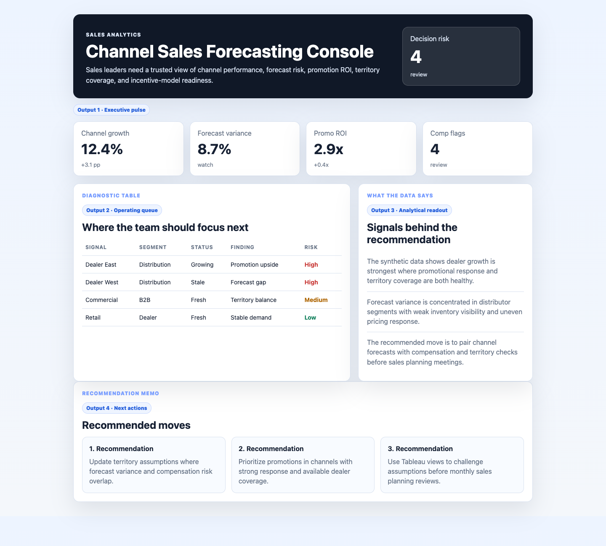

# Channel Sales Forecasting Console

I built this because sales data work is most useful when it moves beyond reporting and actively challenges assumptions about channel performance, promotions, pricing, and territory coverage. The project turns distributor and dealer signals into executive-ready recommendations.



## Why this exists

Sales leaders need a trusted view of channel performance, forecast risk, promotion ROI, territory coverage, and incentive-model readiness.

## What is in the project

- A polished dashboard in `index.html`
- Modular UI/data files in `src/`
- Synthetic operating data in `data/synthetic_operating_data.csv`
- A screenshot captured from the rendered app in `docs/images/dashboard.png`

## Dashboard sections

- Sales pulse: forecast variance, channel growth, promotion ROI, and compensation risk.
- Channel table: dealer segment, trend, pricing signal, and territory action priority.
- Recommendation memo: forecast updates, territory planning, compensation checks, and pricing actions.

## What the data says

The synthetic data shows dealer growth is strongest where promotional response and territory coverage are both healthy.

Forecast variance is concentrated in distributor segments with weak inventory visibility and uneven pricing response.

The recommended move is to pair channel forecasts with compensation and territory checks before sales planning meetings.

## Output walkthrough

### Output 1: Executive pulse

The KPI cards summarize the current operating picture and highlight whether the team should trust, investigate, or act on the latest metrics.

### Output 2: Diagnostic table

The table converts raw operating signals into a ranked queue of risks, owners, and recommended next actions.

### Output 3: Analytical recommendations

The memo turns the analysis into specific business actions that can be discussed in a weekly review or stakeholder workshop.

## Run locally

```bash
python3 -m http.server 4173
```

Then open `http://localhost:4173`.
