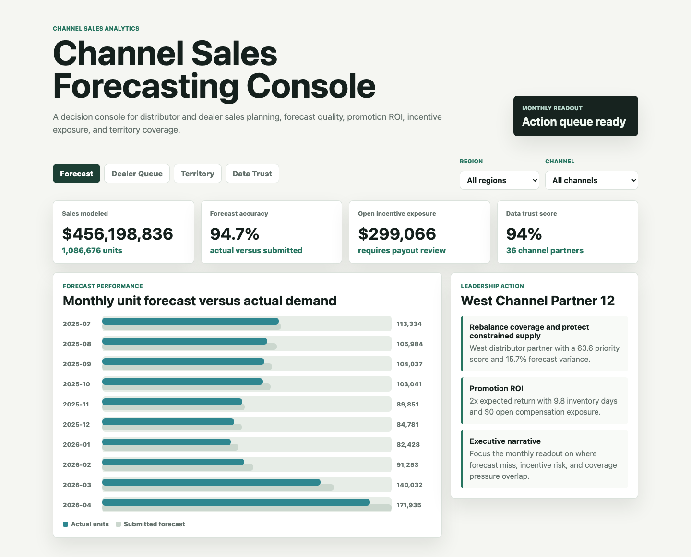
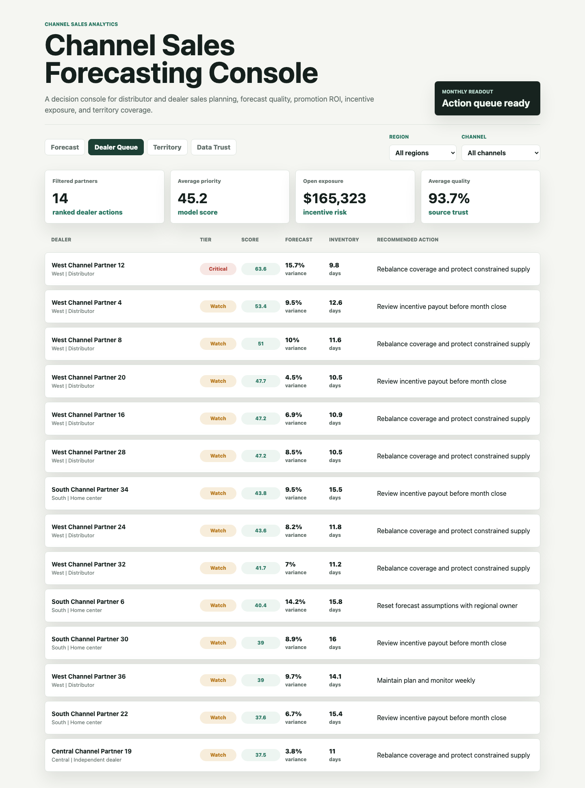
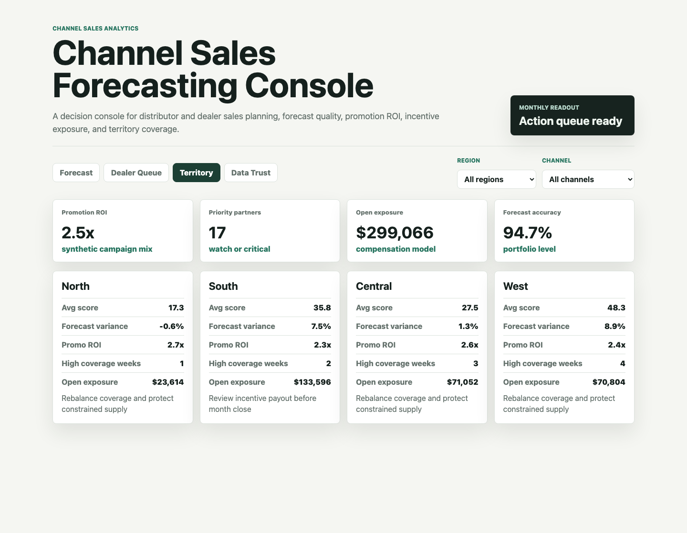
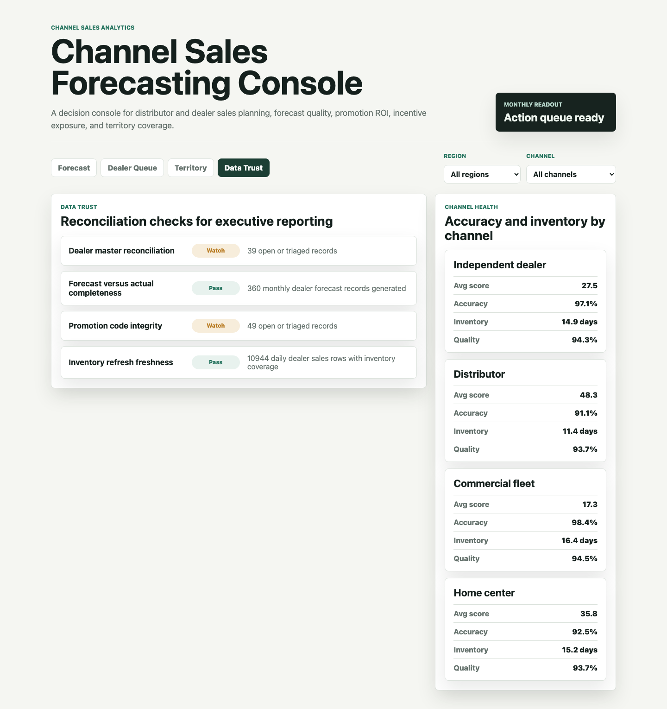

# Channel Sales Forecasting Console

This is a portfolio artifact for a sales analytics role in an outdoor power equipment manufacturer with distributor and dealer channels. It models the monthly workflow a sales data analyst would own: forecast visibility, promotion ROI, incentive exposure, territory coverage, data trust, and executive-ready recommendations.

The project is intentionally more than a dashboard. It includes reproducible synthetic operating data, an explainable dealer priority model, scored analysis outputs, and a multi-surface decision console.

## Screenshots



The forecast cockpit gives sales leadership a monthly view of actual unit demand versus submitted forecasts, plus portfolio KPIs for modeled sales, forecast accuracy, open incentive exposure, and data trust.



The dealer priority queue ranks channel partners by action urgency. The score combines forecast variance, recent sales momentum, inventory coverage, promotion ROI, open compensation exposure, territory pressure, and data quality.



The territory planning view compares regions on priority score, promotion ROI, forecast variance, coverage pressure, and open incentive exposure so managers can decide where to rebalance attention.



The data trust view shows reconciliation checks and channel health so executive recommendations are paired with the source confidence needed to defend them.

## What this demonstrates

- Forecasting and sales performance visibility for a distributor and dealer network.
- Translation of sales data into specific leadership actions.
- Promotion, pricing, and advertising ROI thinking.
- Compensation exposure monitoring before payout close.
- Territory capacity and channel segmentation analysis.
- Data integrity checks that make reporting credible.
- Executive-ready narrative, not just metric reporting.

## Data strategy

The data is synthetic because real dealer-level sales, compensation, inventory, and territory records are private. The synthetic dataset is generated with `scripts/generate_forecasting_artifact.py` using a fixed random seed.

The generator models a realistic outdoor power equipment channel structure:

- 36 channel partners across North, South, Central, and West regions.
- Independent dealer, distributor, commercial fleet, and home center channel types.
- Daily sales from July 2025 through April 2026.
- Spring demand seasonality, since lawn and landscaping demand rises before and during peak outdoor equipment season.
- Different forecast bias, discount behavior, promotion ROI, and incentive exposure by channel type.
- Weekly territory capacity constraints.
- Source-system exceptions such as late point-of-sale files, dealer master mismatches, promotion code gaps, and inventory refresh lags.

Generated data includes:

- `data/dealers.csv`
- `data/dealer_daily_sales.csv`
- `data/monthly_forecasts.csv`
- `data/promotion_calendar.csv`
- `data/compensation_flags.csv`
- `data/territory_capacity.csv`
- `data/source_events.csv`
- `analysis/outputs/dealer_planning_risk.csv`
- `analysis/outputs/priority_queue.csv`

## Scoring model

The dealer priority score is explainable by design. It combines:

- Forecast variance from submitted forecasts versus actual units.
- Inventory risk when coverage falls below 18 days.
- Open compensation exposure.
- Promotion risk when expected ROI falls below 2.4x.
- Territory coverage pressure from recent high-risk weeks.
- Data quality penalties from unresolved source-system exceptions.
- Sales momentum when demand is rising.

Tiers:

- Critical: 58 or above.
- Watch: 34 to 57.9.
- Stable: below 34.

## Repository structure

- `index.html`: interactive forecasting console.
- `src/app.js`: console rendering, filters, tabs, and calculated views.
- `src/data.js`: generated app payload.
- `src/styles.css`: responsive dashboard styling.
- `data/`: synthetic source-style operating files.
- `analysis/`: methodology, analysis plan, executive findings, SQL checks, and scored outputs.
- `scripts/generate_forecasting_artifact.py`: data and model output generator.
- `scripts/score_operating_data.py`: command-line summary of the ranked queue.
- `docs/images/`: rendered screenshots for the README.

## Run locally

```bash
python3 -m http.server 4173
```

Then open `http://localhost:4173`.

Regenerate the synthetic data and app payload:

```bash
python3 scripts/generate_forecasting_artifact.py
```

Print the top scored actions:

```bash
python3 scripts/score_operating_data.py
```

## Scope

This artifact does not use real company data and does not claim to represent real performance. It is a scenario-based portfolio project designed to show how a sales data analyst can connect forecasting, channel performance, incentive controls, territory planning, and data integrity into a leadership decision workflow.
